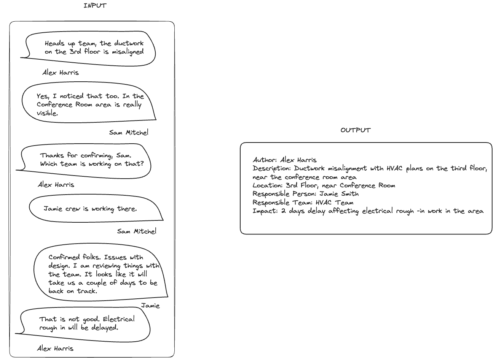

# Smart Issue Detection

## Introduction
Shape is creating a messaging application to support the communication of everyone on site and to boost the work done through our other products: Issue Tracker, Shift Manager. 

On [Issue Tracker](https://www.shape.construction/product/issue-tracker) one can raise, resolve, and report construction blockers and snags as issues. On [Shift Manager](https://www.shape.construction/product/shift-manager) one creates daily site reports faster, updating one's site diary in real-time and getting the team to contribute to it directly. 

Considering the messaging app mentioned and how it will capture information at an unprecedented level, many use cases for technology, such as Large Language Models, come to mind. Most of these use cases centre on contextualising data, structuring it in a way that makes the otherwise dispersed information into actionable insights. 

For this challenge consider that you have access to messages exchange in the messaging application and to our API's database where you can find the existing issues, shift reports, projects and users.

## Outcome
The goal of this project is to take a conversation as input and extract from it the essential information of an Issue. Below is a visual example of what an input will look like and what we envision as an output.

